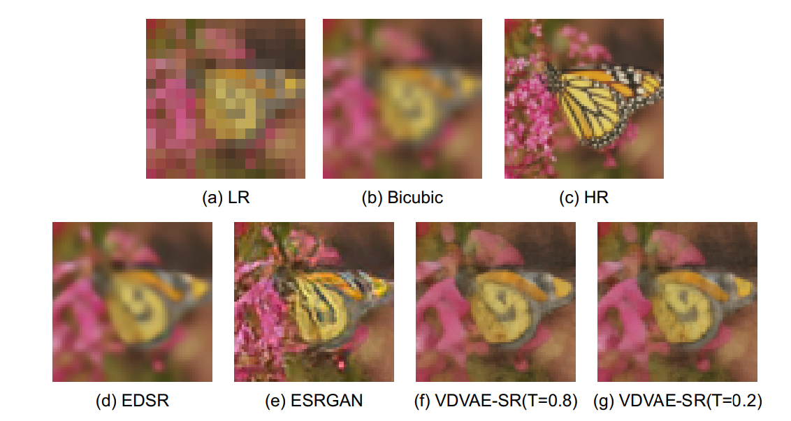
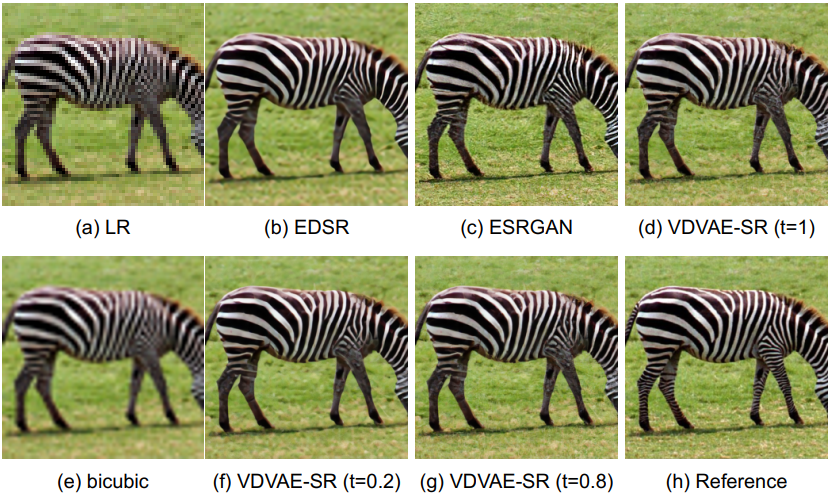
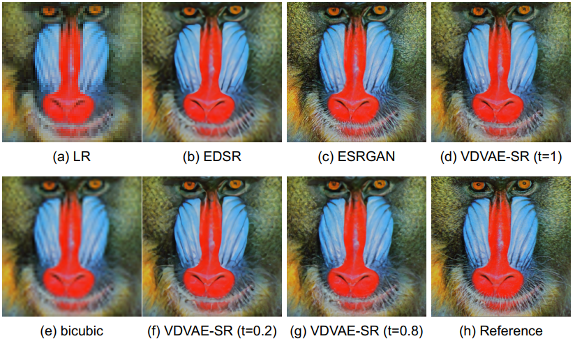
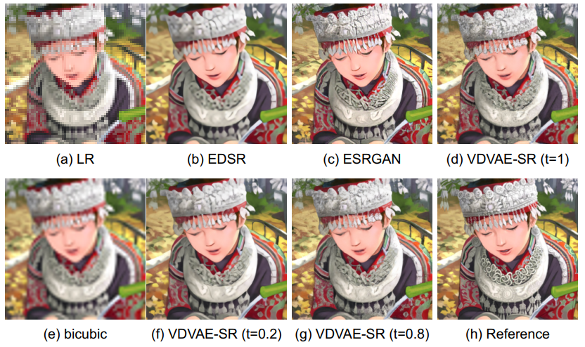

# Image-Super-Resolution-using-Deep-VAEs

## Information

## Description
Image super-resolution (SR) techniques are used to generate a high-resolution image from a low-resolution image. Deep Generative Models (DGMs) such as autoregressive (AR) models, Generative Adversarial Networks (GANs) and Variational Autoencoders (VAEs) have proven to be effective at modelling high-resolution images. In particular, GAN-based SR models have achieved state-of-the-art SR performances. Whereas VAEs used to be criticised for their feeble generative performances, there is now strong evidence that deep VAEs can outperform both GANs and AR models for high-resolution image generation. The project aims at exploiting the most recent deep VAE, specifically the state-of-the-art VDVAE generative model to improve upon existing SR models. 

This project uses transfer learning to utilize the VDVAE model combined with an extra component in order to support the task of image super-resolution with four times upscaling (x4). The model we present, which we call VDVAE-SR was able to output sharper images than a purely Convolutional Neural Network method EDSR (winner of NTIRE17 SR Challenge) in terms of FID score and even comparing to the popular GAN-based SR method ESRGAN (winner of PIRM-2018 SR Challenge).

The purpose of the project was to achieve and develop a super-resolution model based on a Deep VAEs, here the [VDVAE](https://github.com/openai/vdvae) implementation was used to build upon it.

## Usage
To run any of the three models, the Operational IPython Notebooks can be run.
For the Training/Testing data, the datasets can be downloaded from here.
For Training the DIV2K dataset was used, while for Testing the ...

Also, all the packages from requirements.txt are needed in order to run the notebooks.
## Results

